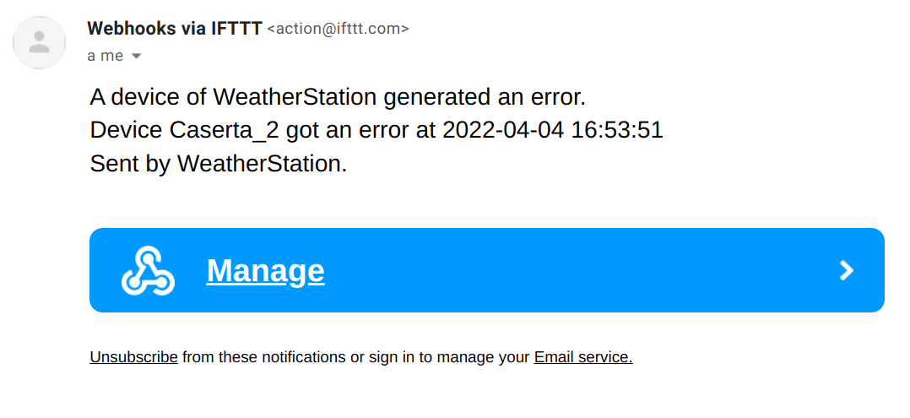
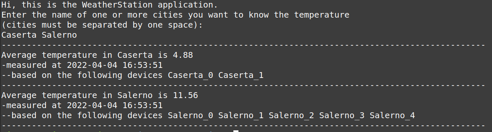
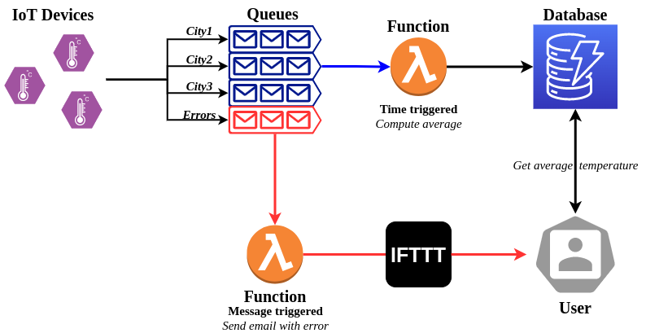

# Weather Station using Serverless computing

## Overview
WeatherStation is a weather station simulator that measure the temperature of the major cities of Campania in Italy. 
The project is based on an IoT Cloud architecture where several IoT sensors collect the data and send them on Cloud where they are processed through Serverless Computing and stored in a NoSQL database to be easily accessible.

The IoT sensors are placed near each major city of Campania region to measure its temperature. Each sensor send a message with the temperature value on the queue related to its city. One queue exists for each city.
Each sensor will send a message containing the following information:
- ID of the sensor;
- time in format yyyy-mm-dd hh:mm:ss;
- name of the city;
- temperature measured.

Each hour, a time triggered Servereless function calculates the average temperature for each major city using the messages stored on the queues. For each queue, the function collects the temperature values, calculates the average and uploads the result on a NoSQL database.
The database contains the last updated average temperature for each city, including information about the date of the measure and the IDs of the IoT devices that provides the data. The item stored within the databased contains the following information:
- name of the city;
- time of the computation in format yyyy-mm-dd hh:mm:ss;
- average temperature;
- ID of the devices that sent the data.

The IoT sensors can fail the temperature measure. In that case the sensor sends an error message on a specific error queue. 
A message sent on the error queue trigger a Serverless function that sends an email notifying the device ID that generated the error.

The user can get the average temperature of one or more cities using a Python function that reads the values from the database.

## Architecture

- The Cloud environment is simulated using [LocalStack](https://localstack.cloud/) to replicate the [AWS services](https://aws.amazon.com/).
- The IoT devices are simulated using a Python function exploiting [boto3](https://boto3.amazonaws.com/v1/documentation/api/latest/guide/quickstart.html) to send messages on the queues.
- The queue are implemented using [Amazon Simple Queue Service (SQS)](https://aws.amazon.com/sqs/).
- The database is built using [Amazon DynamoDB](https://aws.amazon.com/dynamodb/).
- The functions are Serveless functions deployed on [AWS Lambda](https://aws.amazon.com/lambda/).
- The time-triggered function is implemented using [Amazon EventBridge](https://aws.amazon.com/eventbridge/).
- The email is sent using [IFTT](https://ifttt.com/).
- The DynamoDB GUI is available using [dynamodb-admin](https://github.com/aaronshaf/dynamodb-admin).

## Installation and usage

### Prerequisites
1. [Docker](https://docs.docker.com/get-docker/)
2. [AWS CLI](https://docs.aws.amazon.com/cli/latest/userguide/getting-started-install.html)
3. [boto3](https://boto3.amazonaws.com/v1/documentation/api/latest/guide/quickstart.html)
4. *(Optional)* nodejs for database visualization. 

### Setting up the environment
**0. Clone the repository**

`git clone https://github.com/isislab-unisa/WeatherStation.git`

**1. Launch [LocalStack](https://localstack.cloud/)**

`docker run --rm -it -p 4566:4566 -p 4571:4571 localstack/localstack`

**2. Create a SQS queue for each city**

`aws sqs create-queue --queue-name Salerno --endpoint-url=http://localhost:4566`

`aws sqs create-queue --queue-name Caserta --endpoint-url=http://localhost:4566`

`aws sqs create-queue --queue-name Napoli --endpoint-url=http://localhost:4566`

`aws sqs create-queue --queue-name Avellino --endpoint-url=http://localhost:4566`

`aws sqs create-queue --queue-name Benevento --endpoint-url=http://localhost:4566`

`aws sqs create-queue --queue-name Errors --endpoint-url=http://localhost:4566`

- Check that the queues are been correctly created
	
`aws sqs list-queues --endpoint-url=http://localhost:4566`

**3. Create the DynamoDB table and populate it**
	
1) Use the python code to create the DynamoDB table
	
`python3 settings/createTable.py`

2) Check that the tables are been correctly created

`aws dynamodb list-tables --endpoint-url=http://localhost:4566`
	
3) Populate the tables with some data
	
`python3 settings/loadData.py`
	
4) Check that the table are been correctly populated using the AWS CLI (*Press q to exit*)
	
`aws dynamodb scan --table-name Campania --endpoint-url=http://localhost:4566`
	
or using the [dynamodb-admin] GUI with the command
	
`DYNAMO_ENDPOINT=http://0.0.0.0:4566 dynamodb-admin`
	
and then going to `http://localhost:8001`.

**4. Create the time-triggered Lambda function to store the average temperature of each city**
1) Create the role

`aws iam create-role --role-name lambdarole --assume-role-policy-document file://settings/role_policy.json --query 'Role.Arn' --endpoint-url=http://localhost:4566`

2) Attach the policy

`aws iam put-role-policy --role-name lambdarole --policy-name lambdapolicy --policy-document file://settings/policy.json --endpoint-url=http://localhost:4566`

3) Create the zip file

`zip avgFunc.zip settings/avgFunc.py`
	
4) Create the function and save the Arn (it should be something like `arn:aws:lambda:us-east-2:000000000000:function:avgFunc`)

`aws lambda create-function --function-name avgFunc --zip-file fileb://avgFunc.zip --handler settings/avgFunc.lambda_handler --runtime python3.6 --role arn:aws:iam::000000000000:role/lambdarole --endpoint-url=http://localhost:4566`

5) Test the function:
- simulate the messages sent by some IoT devices

`python3 IoTDevices.py`

- manually invoke the function (it may take some times)

`aws lambda invoke --function-name avgFunc --payload fileb://settings/city.json out --endpoint-url=http://localhost:4566`
	
- check within the table that items are changed (the measure date should be different)

**5. Set up a CloudWatch rule to trigger the Lambda function every hour**
1) Creare the rule and save the Arn (it should be something like `arn:aws:events:us-east-2:000000000000:rule/calculateAvg`)

`aws events put-rule --name calculateAvg --schedule-expression 'rate(60 minutes)' --endpoint-url=http://localhost:4566`

2) Check that the rule has been correctly created with the frequency wanted

`aws events list-rules --endpoint-url=http://localhost:4566`

3) Add permissions to the rule created 

`aws lambda add-permission --function-name avgFunc --statement-id calculateAvg --action 'lambda:InvokeFunction' --principal events.amazonaws.com --source-arn arn:aws:events:us-east-2:000000000000:rule/avgFunc --endpoint-url=http://localhost:4566`

4) Add the lambda function to the rule using the JSON file containing the Lambda function Arn

`aws events put-targets --rule calculateAvg --targets file://settings/targets.json --endpoint-url=http://localhost:4566`

Now every hour the function avgFunc will be triggered.

**6. Set up the Lambda function triggered by SQS messages that notifies errors in IoT devices via email**

1) Create the IFTT Applet
	1. Go to https://ifttt.com/ and sign-up or log-in if you already have an account.
	2. On the main page, click *Create* to create a new applet.
	3. Click "*If This*", type *"webhooks"* in the search bar, and choose the *Webhooks* service.
	4. Select "*Receive a web request*" and write *"email_error"* in the "*Event Name*" field. Save the event name since it is required to trigger the event. Click *Create trigger*.
	5. In the applet page click *Then That*, type *"email"* in the search bar, and select *Email*.
	6. Click *Send me an email* and fill the fields as follow:
- *Subject*: `[WeatherStation] Attention a device encountered an error!`
		
- *Body*: `A device of WeatherStation generated an error.  Device {{Value1}} got an error at {{Value2}}   Sent by WeatherStation.`
	
	7. Click *Create action*, *Continue*, and *Finish*.

2) Modify the variable `key` within the `emailError.py` function with your IFTT applet key. The key can be find clicking on the icon of the webhook and clicking on *Documentation*.

3) Zip the Python file and create the Lambda function

`zip emailError.zip settings/emailError.py`

`aws lambda create-function --function-name emailError --zip-file fileb://emailError.zip --handler settings/emailError.lambda_handler --runtime python3.6 --role arn:aws:iam::000000000000:role/lambdarole --endpoint-url=http://localhost:4566`

4) Create the event source mapping between the funcion and the queue

`aws lambda create-event-source-mapping --function-name emailError --batch-size 5 --maximum-batching-window-in-seconds 60 --event-source-arn arn:aws:sqs:us-east-2:000000000000:Errors --endpoint-url=http://localhost:4566`

5) Test the mapping sending a message on the error queue and check that an email is sent

`aws sqs send-message --queue-url http://localhost:4566/000000000000/Errors --message-body '{"device_id": "test_error","error_date": "test"}' --endpoint-url=http://localhost:4566`

### Use it
1. Simulate the IoT devices

`python3 IoTdevices.py`

2. Wait that the average Lambda function compute the average or invoke it manually

3. Get the average temperature of the city of interest

`python3 getTemperature.py`

## Future work
- Implement a more user-friendly interface to get the temperature of cities.
